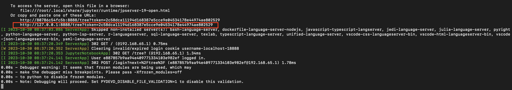

# pygplates-tutorials

## Introduction

This repository contains jupyter notebooks which demonstrate how to use pygplates in plate tectonic research. The notebooks are designed to be a companion to the pygplates documentation. The documentation contains sample code illustrating in a general sense how to perform certain tasks; these notebooks contain worked examples on actual data sets.

## Getting Started

### Step 1: Download the repository

`git clone --depth=1 https://github.com/GPlates/pygplates-tutorials.git`

Note that this requires git to be [installed](https://git-scm.com/book/en/v2/Getting-Started-Installing-Git) on your local system.
Alternatively you can download the repository as a zip file (and extract on your local system).

### Step 2: Pull the gplates/pygplates-notebook docker container

install Docker https://www.docker.com/ if you have not done so.

`docker pull gplates/pygplates-tutorials`

### Step 3: Run the Docker container

in the top level folder of this repository(pygplates-tutorials)

`` docker run -it --rm -p 8888:8888 -v `pwd`:/workspace gplates/pygplates-tutorials ``

Note that this sets up Docker to display notebooks in your current working directory (where you cloned or downloaded the Github repository).

### Step 4: Open the notebooks in a web browser

`http://localhost:8888/tree/notebooks`

Note that if you are running _Docker Toolbox on Windows_ then replace `localhost` with the output of `docker-machine ip`. The token can be found in the terminal(see the screenshot below).



## Run in Conda environment

- `conda create --name pygplates-tutorials --c conda-forge gplately jupyter moviepy plate-model-manager`
- `conda activate pygplates-tutorials`
- `jupyter notebook`
- run the notebook at http://localhost:8888

## Notes about Docker:

You don't need to read this section unless you are interested in learning a bit about Docker.

### build the docker image:

```
cd docker
docker build -t gplates/pygplates-tutorials .
```

### run the docker container:

```
cd pygplates-tutorials
docker run -it --rm -p 8888:8888 -v `pwd`:/home/workspace gplates/pygplates-tutorials
```

### push Docker image to Dockerhub.com

```
docker push gplates/pygplates-tutorials
```

## About

These tutorials stem from the work of Simon Williams, Michael Tetley, John Cannon and Michael Chin at
EarthByte Group, University of Sydney, 2016-present

For general information on GPlates, please see the gplates website:
https://www.gplates.org

The pygplates documentation can be found here:
https://www.gplates.org/docs/pygplates/index.html

If you have issues or questions, you may post the questions in GPlates online forum https://discourse.gplates.org.

or submit an inquiry here https://www.earthbyte.org/contact-us-3/
