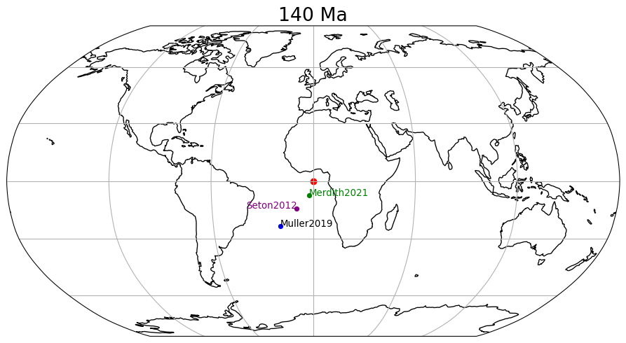

#### 👉 [pygplates-getting-started.ipynb](pygplates-getting-started.ipynb)

This notebook is a simple pygplates tutorials introduction. You should start from here if you are new to PyGPlates.

#### 👉 [working-with-plate-model-manager.ipynb](working-with-plate-model-manager.ipynb)

The [Plate Model Manager](https://github.com/michaelchin/plate-model-manager#readme) is a dataset manager for plate tectonic models. It is similar to NPM or Conda for software packages. This notebook shows how to use the Plate Model Manager to download and manage plate tectonic reconstruction models.

#### 👉 [pygplates-assign-plateids.ipynb](pygplates-assign-plateids.ipynb)

This notebook will show you how to assign plate ids to PyGPlates features. The plate ids are essential in plate tectonic reconstruction.

#### 👉 [pygplates-fileio.ipynb](pygplates-fileio.ipynb)

This notebook will demonstrate PyGPlates basic file I/O.

#### 👉 [pygplates-Flowlines.ipynb](pygplates-Flowlines.ipynb)

This notebook details dynamic construction and plotting within a python script of synthetic flowlines generated from a plate model.

#### 👉 [pygplates-Motion-Paths.ipynb](pygplates-Motion-Paths.ipynb)

A motion path is a gplates feature type that traces the motion of a seed point on one plate relative to some other plate/frame of reference.

#### 👉 [pygplates-reconstruct-to-birth-time.ipynb](pygplates-reconstruct-to-birth-time.ipynb)

This notebook will reconstruct a set of features to their 'birth' time.

#### 👉 [pygplates-topologies.ipynb](pygplates-topologies.ipynb)

This notebook goes through some examples of how to work with topological plate polygons using pygplates.

#### 👉 [gplates-working-with-feature-geometries.ipynb](gplates-working-with-feature-geometries.ipynb)

This notebook shows how to work with feature geometries.

#### 👉 [pygplates-Working-with-Rotation-Poles.ipynb](pygplates-Working-with-Rotation-Poles.ipynb)

This notebook works with rotation poles.

#### 👉 [hotspot-tracking-movie-maker.ipynb](hotspot-tracking-movie-maker.ipynb)

This notebook makes a hotspot movie.

#### 👉 [time-latitude-plots.ipynb](time-latitude-plots.ipynb)

This notebook deals with time latitude plots.

#### 👉 [track-point-through-topologies.ipynb](track-point-through-topologies.ipynb)

This notebook tracks point through topologies.

#### 👉 [velocity-basics.ipynb](velocity-basics.ipynb)

This notebook demonstrates basic velocity calculation.

#### 👉 [velocity-fields.ipynb](velocity-fields.ipynb)

This notebook shows velocity fields.

#### 👉 [plate-tectonics-over-time.ipynb](plate-tectonics-over-time.ipynb)

This notebook reconstructs variable datasets back in time.

#### 👉 [pygplates-reconstruct-gmt-file.ipynb](pygplates-reconstruct-gmt-file.ipynb)

This notebook reconstructs datra in a GMT file.

## Other Miscellaneous Notebooks

Besides the tutorial notebooks above, we also have two other miscellaneous notebooks which were designed for teaching purpose. You are welcome to check them out.

These online plate tectonic teaching resources are designed to explore (1) where earthquakes occur, (2) how the configuration of continents and plate boundaries has changed through time and (3) in where different sorts of mineral deposits occur in the context of plate boundaries. These online teaching resources are based on Jupyter Notebook which provides an interactive computational environment, in which one can combine code execution, rich text, mathematics, plots and rich media. For more details on the Jupyter Notebook, please see the Jupyter website.

#### 👉 [mineral-deposits-investigation.ipynb](https://github.com/EarthByte/miscellaneous-notebooks/blob/master/notebooks/mineral-deposits-investigation.ipynb)

A commercially interesting application of all of this data and technology is to find valuable mineral deposits. We might be able to predict where new deposits will be discovered!

#### 👉 [plate-tectonics-and-earthquakes.ipynb](https://github.com/EarthByte/miscellaneous-notebooks/blob/master/notebooks/plate-tectonics-and-earthquakes.ipynb)

This notebook contains some simple scripts which will help us to understand present day plate tectonics in terms of where earthquakes occur relative to plate boundaries.
